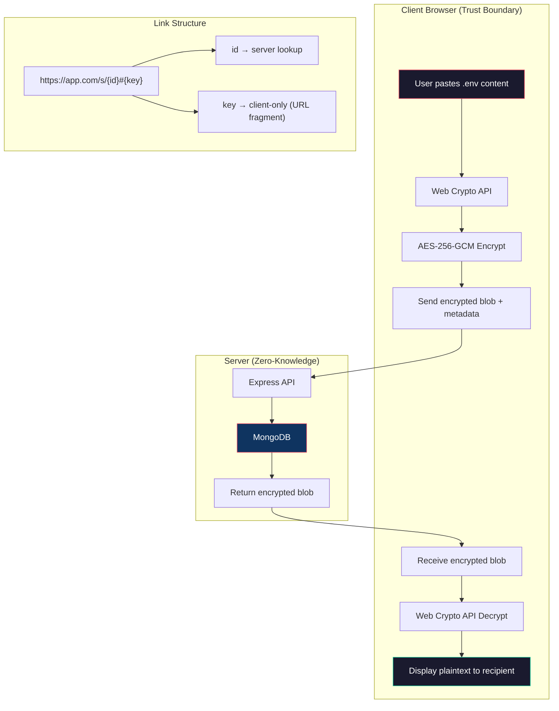
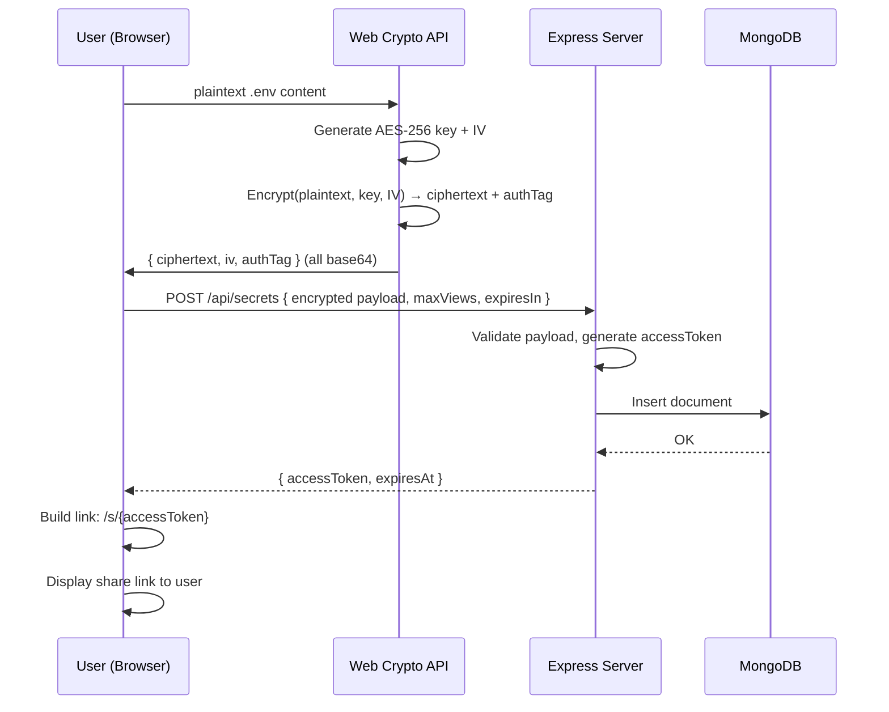
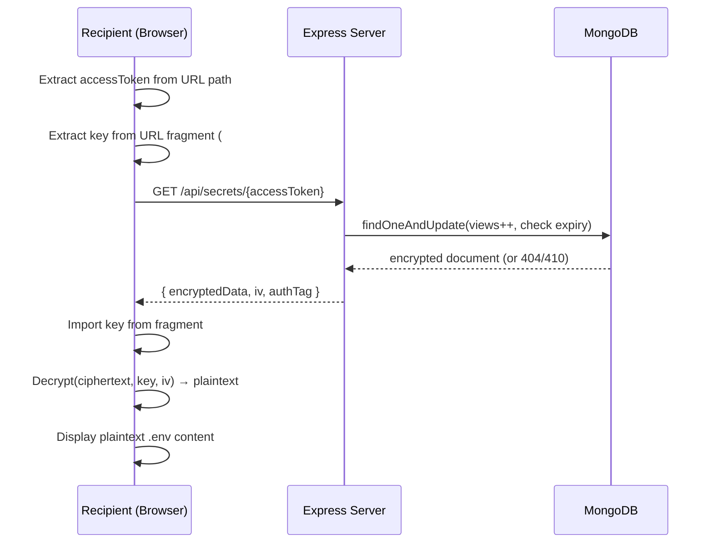
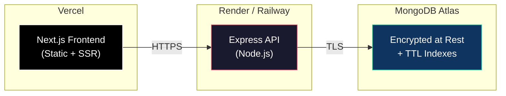

# SecureEnv — Architecture & System Design

> A zero-trust, end-to-end encrypted .env file sharing platform.

---

## 1. System Architecture Overview



### Key Principle: The Fragment Trick

The encryption key is embedded in the **URL fragment** (`#` portion). Per RFC 3986, the fragment is **never sent to the server** — it stays entirely in the browser. This means:

- The server stores encrypted data but has **zero access** to the decryption key
- The share link itself is the decryption mechanism
- If the link is intercepted, the attacker gets the key — but we mitigate this with optional password protection (PBKDF2)

---

## 2. Encryption Scheme

### 2.1 Without Password (Default)

```
1. Generate 256-bit AES key (crypto.getRandomValues)
2. Generate 96-bit IV (crypto.getRandomValues)
3. Encrypt plaintext with AES-256-GCM (produces ciphertext + 128-bit auth tag)
4. Store on server: { iv, ciphertext, authTag } (all base64)
5. Share link: https://app.com/s/{docId}#{base64url(key)}
6. Recipient extracts key from fragment, fetches encrypted data, decrypts client-side
```

### 2.2 With Password (Enhanced Security)

```
1. Generate 256-bit salt (crypto.getRandomValues)
2. Derive AES-256 key from password using PBKDF2 (600,000 iterations, SHA-256)
3. Generate 96-bit IV
4. Encrypt plaintext with AES-256-GCM
5. Store on server: { iv, salt, ciphertext, authTag }
6. Share link: https://app.com/s/{docId} (NO fragment — key is derived from password)
7. Recipient enters password, derives same key via PBKDF2, decrypts
```

> [!IMPORTANT]
> PBKDF2 with 600,000 iterations follows OWASP 2024 recommendations for password-based key derivation.

### 2.3 Why AES-256-GCM?

| Property | Benefit |
|----------|---------|
| Authenticated encryption | Detects tampering (auth tag) |
| 256-bit key | Quantum-resistant key length |
| GCM mode | Parallelizable, hardware-accelerated |
| Web Crypto native | No JS crypto library dependencies |

---

## 3. MongoDB Schema

```javascript
// Collection: secrets
{
  _id: ObjectId,
  
  // Lookup token — NOT the MongoDB _id (prevents enumeration)
  accessToken: String,        // 32-byte crypto-random, hex-encoded (indexed, unique)
  
  // Encrypted payload (server never sees plaintext)
  encryptedData: String,      // Base64-encoded ciphertext
  iv: String,                 // Base64-encoded initialization vector (12 bytes)
  authTag: String,            // Base64-encoded GCM authentication tag (16 bytes)
  salt: String,               // Base64-encoded PBKDF2 salt (only if password-protected)
  
  // Access control
  isPasswordProtected: Boolean,
  maxViews: Number,           // null = unlimited
  currentViews: Number,       // Starts at 0
  
  // Expiration
  expiresAt: Date,            // TTL index — MongoDB auto-deletes
  
  // Metadata (no secrets here)
  createdAt: Date,
  ipHash: String,             // SHA-256 of creator IP (for rate limiting, not tracking)
  
  // Anti-replay
  burnedAt: Date,             // Set when max views reached or manually burned
}

// Indexes
db.secrets.createIndex({ accessToken: 1 }, { unique: true })
db.secrets.createIndex({ expiresAt: 1 }, { expireAfterSeconds: 0 })  // TTL auto-delete
db.secrets.createIndex({ ipHash: 1, createdAt: 1 })                  // Rate limiting
```

> [!NOTE]
> The `expiresAt` TTL index means MongoDB **automatically deletes** expired documents. No cron job needed.

---

## 4. API Design

### 4.1 Routes

| Method | Path | Purpose | Auth |
|--------|------|---------|------|
| `POST` | `/api/secrets` | Store encrypted secret | Rate-limited |
| `GET` | `/api/secrets/:token` | Retrieve encrypted secret | Token |
| `DELETE` | `/api/secrets/:token` | Manually burn a secret | Token |
| `GET` | `/api/secrets/:token/meta` | Get metadata (views left, expiry) without consuming a view | Token |
| `GET` | `/api/health` | Health check | None |

### 4.2 POST /api/secrets

**Request:**
```json
{
  "encryptedData": "base64...",
  "iv": "base64...",
  "authTag": "base64...",
  "salt": "base64... (optional)",
  "isPasswordProtected": false,
  "maxViews": 3,
  "expiresIn": 3600
}
```

**Response:**
```json
{
  "accessToken": "a1b2c3d4...",
  "expiresAt": "2026-05-02T22:00:00Z"
}
```

### 4.3 GET /api/secrets/:token

**Response (200):**
```json
{
  "encryptedData": "base64...",
  "iv": "base64...",
  "authTag": "base64...",
  "salt": "base64... (if password-protected)",
  "isPasswordProtected": true,
  "viewsRemaining": 2,
  "expiresAt": "2026-05-02T22:00:00Z"
}
```

**Response (404):** Secret not found, expired, or burned.
**Response (410):** Secret has been burned (max views reached).

> [!WARNING]
> Every `GET /api/secrets/:token` call **atomically increments** `currentViews` using MongoDB's `findOneAndUpdate`. This prevents race conditions where two simultaneous requests could both read before the view count is updated.

---

## 5. Security Measures

### 5.1 Rate Limiting

```
- POST /api/secrets:  5 requests per IP per 15 minutes
- GET  /api/secrets:  30 requests per IP per 15 minutes
- Global:             100 requests per IP per 15 minutes
```

### 5.2 Anti-Abuse

| Threat | Mitigation |
|--------|------------|
| Brute-force token guessing | 32-byte random tokens = 2²⁵⁶ possibilities |
| Replay attacks | View count atomically incremented; burned secrets return 410 |
| Enumeration | Tokens are random, not sequential; 404 for all invalid tokens |
| XSS | CSP headers, input sanitization, no `dangerouslySetInnerHTML` |
| CSRF | SameSite cookies (if auth added), CORS whitelist |
| Large payloads | 50KB max encrypted data size |
| MongoDB injection | Mongoose schema validation, parameterized queries |

### 5.3 Headers (Helmet.js)

```
Content-Security-Policy: default-src 'self'
X-Content-Type-Options: nosniff
X-Frame-Options: DENY
Strict-Transport-Security: max-age=31536000; includeSubDomains
Referrer-Policy: no-referrer
```

> [!CAUTION]
> The `Referrer-Policy: no-referrer` header is **critical** — it prevents the share URL (which contains the encryption key in the fragment) from leaking via the Referer header if the user clicks an external link from the app.

---

## 6. Data Flow

### 6.1 Creating a Secret



### 6.2 Retrieving a Secret



---

## 7. Project Structure

```
g:\RENDER\
├── client/                    # Next.js 14 (App Router)
│   ├── src/
│   │   ├── app/
│   │   │   ├── layout.tsx
│   │   │   ├── page.tsx       # Home — create secret
│   │   │   └── s/
│   │   │       └── [token]/
│   │   │           └── page.tsx   # View secret
│   │   ├── components/
│   │   │   ├── CreateSecret.tsx
│   │   │   ├── ViewSecret.tsx
│   │   │   ├── SecretLink.tsx
│   │   │   └── PasswordInput.tsx
│   │   └── lib/
│   │       ├── crypto.ts      # All E2EE logic
│   │       └── api.ts         # API client
│   ├── tailwind.config.ts
│   ├── next.config.ts
│   └── package.json
│
├── server/                    # Express API
│   ├── src/
│   │   ├── models/
│   │   │   └── Secret.ts
│   │   ├── routes/
│   │   │   └── secrets.ts
│   │   ├── middleware/
│   │   │   ├── rateLimiter.ts
│   │   │   └── validate.ts
│   │   ├── utils/
│   │   │   └── token.ts
│   │   └── index.ts
│   ├── tsconfig.json
│   └── package.json
│
└── README.md
```

---

## 8. Deployment Architecture



### Deployment Steps

1. **MongoDB Atlas**: Create M0 (free) cluster, enable encryption at rest, create TTL index
2. **Express API**: Deploy to Render/Railway with env vars (`MONGODB_URI`, `CORS_ORIGIN`)
3. **Next.js Frontend**: Deploy to Vercel, set `NEXT_PUBLIC_API_URL` env var
4. **DNS + HTTPS**: Both Vercel and Render provide automatic HTTPS

---

## 9. Threat Model Summary

| Asset | Threat | Control |
|-------|--------|---------|
| Plaintext secrets | Server compromise | E2EE — server never sees plaintext |
| Encryption key | Network interception | Key in URL fragment (never sent to server); HTTPS |
| Encryption key | Link interception | Optional password protection (PBKDF2) |
| Stored data | Database breach | AES-256-GCM encrypted; MongoDB encryption at rest |
| Access tokens | Brute force | 256-bit random tokens; rate limiting |
| Service | DoS | Rate limiting; payload size limits |
| Expired secrets | Data retention | TTL auto-delete; view-count burn |
